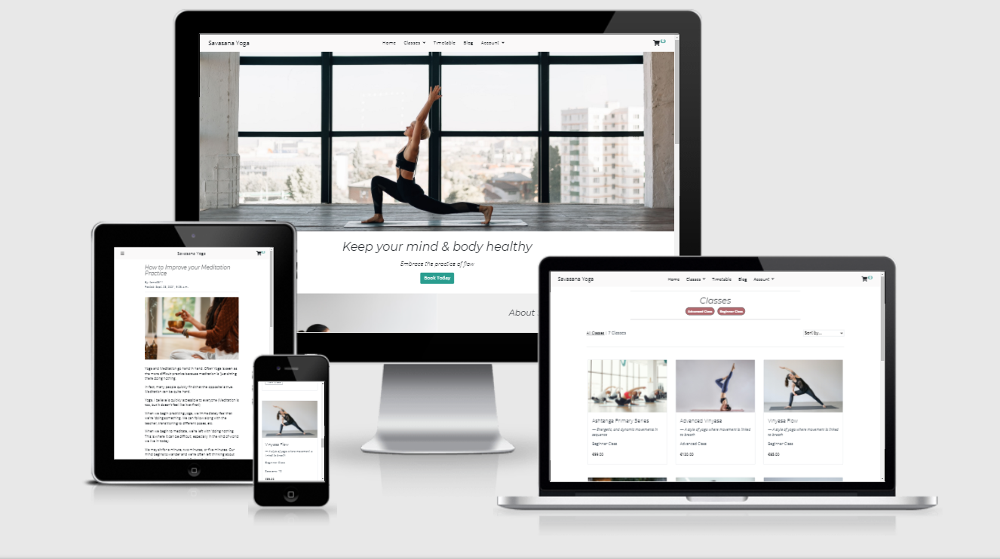
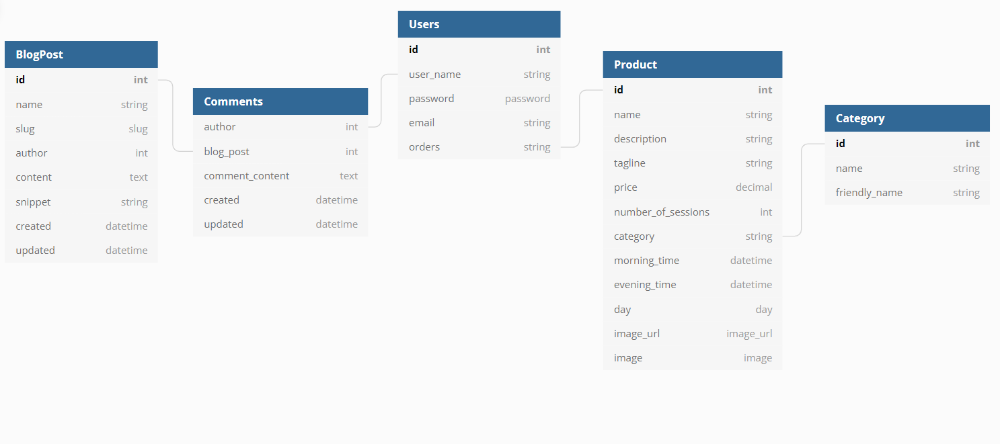

# Savasana Yoga

Savasana Yoga is a website to promote the benefits of yoga. This website aims to promote, discover and book yoga classes offered by Savasana Yoga Studio. 

[You can view the live project here](https://tomc-savasana-yoga.herokuapp.com/)



## Overview

An e-commerce website for people who want to practice yoga, and purchase yoga classes. The website also offers people the opportunity to learn more about the benefits of practicing yoga via blog posts.

The website is developed with a mobile-first approach as most users now visit a website via their mobile. The website maintains responsiveness across all devices; desktop, tablet, and mobile. 

The website is built with Django and features a fully functional e-commerce store, to allow users to purchase yoga classes. The website provides the ability for a user to create a profile, which facilitates a smoother booking process, and the ability to view their order history. 

The main goal of this website is to promote the practice of yoga, highlight its benefits, and offer classes for both beginner and advanced yogis. The website also features a blog, which promotes the benefits of yoga, provides announcements for the yoga studio, and allows users to comment on blog posts. 

Finally, the website also provides admin features to manage yoga classes, by editing, deleting, and adding new classes, and blog posts, adding, editing, and removing blog posts, as well as the ability to moderate by approving or removing pending user comments.


## User Stories

* I want a website that allows me to book yoga classes.
* I want a website that provides me information about the yoga classes
* I want to be able to book multiple classes
* I want to be able to review and change my cart before purchasing classes
* I want to receive an email confirmation after booking a class.
* I would like a blog to read more about the yoga studio, and yoga in general.
* I would like the ability to comment on blog posts.
* I would like the ability to remove comments I make on a blog post.
* I want the ability to filter classes between difficulty levels.
* I want the ability to view a timetable or schedule for yoga classes.
* I want a website that is easily accessed on my mobile phone and tablet. 
* I want a website that is easy to understand and navigate.
* I want to have my profile to store my information.
* I want to view my order history on my profile.  
* I want my profile to be password protected.
* I would like to be able to follow the website's social media accounts.
* I would like to be able to search for classes.

## Project Goals

* I want to promote the yoga classes offered by Savasana Yoga Studio.
* I want to allow users to book yoga classes.
* I want to grow the website's social media presence. 
* I want users to be able to create their profile and view their order history.
* I want users to understand and navigate the website upon their first visit. 
* I want users to be able to filter classes based on difficulty level.
* I want to promote the benefits of yoga, and the studio's classes via blog posts.
* I want to allow users to comment on blog posts.
* I want to moderate the comments on blog posts.
* I want to be able to store all bookings in a database. 
* I want to allow users to view the days and times for yoga classes.


## UX

The practice of yoga can have many benefits, including stress management, relieving anxiety, improving quality of sleep, fitness, and flexibility. I created this website to help promote yoga and facilitate a place where people can book yoga classes offered by Savasana Yoga Studio. 

## Strategy 

The goal of this website is to offer accessible yoga classes for beginners and advanced yoga enthusiasts. The website was built with a focus on newcomers to yoga, to make yoga seem less intimidating and showcase the variety of yoga classes offered.

The secondary goal of the website is to promote Savasana's Yoga Studio by driving users to the studio's social media accounts and promoting the studio on the website via the blog.

### Business Goals: 

* Promote booking of a variety of yoga classes offered.
* A simple and easy-to-navigate website with a clear purpose.
* Mobile-first design to increase ease of use for those without PCs.
* Increase web presence to grow the brand via the blog and social media accounts.

### User Goals: 

* Searching for a yoga class to book.
* Ability to purchase yoga classes.
* Clear distinction of yoga class difficulty levels.
* A profile to save my information and order history.
* A blog to read about yoga, and comment to share my thoughts.
* Mobile-friendly website as the majority of users browses via mobile. 
* An easy-to-understand and navigate website. 
* A website that allows me to filter yoga classes via difficulty.
* A password-protected profile.
* To follow the website's social media accounts. 
* To view the days and times for offered yoga classes.


## Scope 

The Scope and features of this project were based on a personal interest in the practice of yoga. 

When I first became interested in yoga, I found it challenging to find a place with several different types of yoga classes. I also found it challenging to find an easy-to-understand website where I can check which yoga classes are on at certain times, and which classes best suit my experience level.

With this in mind, I felt overwhelmed and unsure of what to book/attend. As a result, I created Savasana Yoga to facilitate an easy-to-navigate and easy-to-understand website, that offers a wide variety of classes and allows the filtering of yoga classes based on a user's experience level.


## Structure 

An important aspect of a successful website is to provide users with a simple, and easy-to-navigate experience and interface. The goal of the website was to feel professional, approachable and promote a user's confidence when navigating throughout the website. 

The home page features a large image, a blurb on the benefits of yoga, a call-to-action button to encourage users to book a class, and some information about the yoga studio itself. 

I have also created a footer, which allows for quick navigation via a basic site map. I have also populated the footer with social media links, and a search bar to quickly search for yoga classes. 

As there are several pages on this website, I wrote a summary of each page in the 'Features' section below.


## Skeleton 

All wireframes were created using Balsamiq. Some design aspects of the website has changed from the initial wireframe, for example the use of images in the blog snippets. Although the wireframes provided an outline, I made some creative choices throughout the development cycle.

Note: To open links in a new tab please use CTRL+click (on Windows and Linux) or CMD+click (on macOS).

All wireframes were created using Balsamiq. 

Home Page | Products Page | Product Detail Page
------------ | ------------- | ------------
[Home Page Desktop](./docs/wireframes/home-page-desktop.png) | [Product Page Desktop](./docs/wireframes/products-page-desktop.png) | [Product Detail Page Desktop](./docs/wireframes/product-detail-desktop.png)
[Home Page Tablet](./docs/wireframes/home-page-tablet.png) | [Product Page Tablet](./docs/wireframes/products-page-tablet.png) | [Product Detail Page Tablet](./docs/wireframes/product-detail-tablet.png)
[Home Page Mobile](./docs/wireframes/home-page-mobile.png) | [Product Page Mobile](./docs/wireframes/products-page-mobile.png) | [Product Detail Page Mobile](./docs/wireframes/product-detail-mobile.png)

Blog Page | Blog Detail Page | User Profile Page
------------ | ------------- | ------------
[Blog Page Desktop](./docs/wireframes/blog-page-desktop.png) | [Blog Detail Desktop](./docs/wireframes/blog-detail-desktop.png)| [User Profile Desktop](./docs/wireframes/user-profile-desktop.png)
[Blog Page Tablet](./docs/wireframes/blog-page-tablet.png) | [Blog Detail Tablet](./docs/wireframes/blog-detail-tablet.png) | [User Profile Tablet](./docs/wireframes/user-profile-tablet.png)
[Blog Page Mobile](./docs/wireframes/blog-page-mobile.png) | [Blog Detail Mobile](./docs/wireframes/blog-detail-mobile.png) | [User Profile Mobile](./docs/wireframes/user-profile-mobile.png)


## Surface 

### Images

There are two main aspects of images used throughout this app; Static and Dynamic images. 

1. Static Images 
- The first is by storing images in a static folder. I have stored the home page images here, as they will not be altered.

I choose this landing page image, as the photo is quite zoomed out, and allows a lot of space, and breathing room on the left-hand and right-hand sides of the person in the image. I also choose to use this image because it had a lot of white in it, and I wanted the home page to match the background colors of the website; greys and whites.  

2. Dynamic Images
- All product images are stored via AWS. 

Since a user with admin privileges can edit, add, and remove products, I decided to use AWS to host the images. Each time an image is updated in the database it is reflected on Heroku. In addition, storing the images on AWS avoids the risk of the images being removed once the website is deployed and running on Heroku.

### Colours

Yoga is relaxing and sometimes viewed as an elegant form of exercise. I wanted to maintain that philosophy when developing the website. I felt that using little colour, was a way of achieving this. 

I decided to keep the background color and the navigation bar the same type of white (#).

To split the screen space up, and offer a bit of diversity, while still maintaining the feel of a clean, relaxing, and elegant look, I used an off-grey(#) for the footer. I felt this added some variety and also complimented the white background color. 

For the buttons, I have decided to use two different kinds. 

I opted to use a light blue (#) for the booking and checkout buttons. And a red (#) for the back buttons. 
I felt these colors were subtle, and warm without providing too much contrast and boldness from the white background color.


### Font 

I decided to use 'Open Sans' as the main font for this website. The font is used on all body text besides headings. I chose Open Sans because of its simplicity, elegance, and versatility. It's an easy-to-read font, but I also feel it has some character. 

For the headings, I decided to use 'Montserrat'. I decided to use this font as it complimented the simplicity and elegance that Open Sans provided. 

### Icons 

I initially decided to use a lot of icons throughout the website, however as development continued, I felt that the icon was distracting. For example, I first had an icon for the Account nav-item, but I felt the navigation bar looked cleaner without the icon. 

I have utilized icons sparingly throughout the website. On the All Products page, I used a calendar icon to indicate a link to the Timetable page. 

I have utilized Font Awesome's Social Media icons to display the yoga studio's social media accounts. These are located in the footer of the website. When a user clicks the icon, a new tab opens, directing them to the relevant social media website. Currently, these links do not direct to a real profile as the project was built for a fictional yoga studio.

I have also used Font Awesome's hamburger bars for the navigation menu on mobile devices. 

## Features

### Current Features

The website features a fully functional e-commerce store to book yoga classes, password-protected profiles, a dynamic timetable to display currently offered yoga classes, a fully functional blog to display posts, news, and updates. 

In addition, the website was developed with a mobile-first approach and is fully responsive across all devices. 

I have provided more details on the features of the website below:

#### The Navigation Menu

The navigation menu is consistent for all users, except for one small difference. Admin users have an extra menu item in the Account dropdown called 'Class Management'. This link directs admin users to a form that allows them to create a new yoga class.

The navigation menu is divided into 6 nav items:

- Home: links users back to the homepage.
- Classes: this is a dropdown menu to display the yoga classes categories (Beginner and Advanced classes).
- Timetable: this links users to a dynamic timetable that displays the days and times yoga classes are offered.
- Blog: this links users to the blog page, to view all blog posts. 
- Account: this is a dropdown menu that displays 'Register and Login' when a user isn't currently logged in. When a user is logged in, it displays 'Sign Out and My Profile'. The 'My Profile' directs users to their profile page, where they can view their order history, and add/edit/remove their personal information. 

The final navigation link, the Shopping Cart, is utilized as an icon. I have decided to use an icon here, and push it to the right-hand side of the screen to separate it from the other navigation links. I have also added a counter to the icon, which displays the number of items currently in the shopping cart. When a user clicks on the Shopping Cart icon, they are directed to the shopping cart page, where they can view/edit/remove items currently in their cart.

#### The Footer Section 

Each page contains a footer, which has a basic site map that displays links for the following pages:
- Home
- Classes
- Timetable
- Blog 

The footer contains social media links for the website's social media accounts. When each icon is clicked, they open a new tab to direct the user to the relevant social media website.

I have also created a search bar in the footer to allow users to quickly search for yoga classes. When a user searches for yoga classes, they are directed to the products page and shown the relevant results, otherwise, they are informed that the search criteria provided no results. 


#### Home App

This app acts as the home page and informs the user about the content and purpose of the website. This app contains a hero image, a call to action button to view products. 

This page also features an 'about' section which informs the users of the yoga studio's philosophy. 

Finally, the page also features three product cards which are filtered by the beginner category to quickly showcase to the user the beginner-friendly classes that are offered. 

In addition, the home page displays the latest blog post to encourage readers to visit the studio's blog. 

#### Products App

This app facilitates the feature to all users to see all products offered by the yoga studio. This app allows users to also view more information about a product, by visiting the product detail page. 

Finally, this app also allows admin users to create, edit, and delete all products in the database.

1. All Products Page

This page displays all products currently being offered. A user can sort products both in ascending and descending by name, price, and category. 

A user also can filter products by category (for instance, beginner or advanced classes)

Finally, a user can search for products by name, category, or keyword search via a product's description in the search bar in the footer which is displayed on every page. 

2. Individual Product Page

The individual products page is created mostly with template tags, to allow the variety of information in each product to be displayed correctly. 

The page features a larger size of the product image, a product description, and information regarding the product's price, and timetable information. 

The page also features a link to the timetable page, for users to look at other times which may suit them, and which classes the best suit their time schedule.

Finally, the page also features an add to cart button and a button that redirects users back to the all products page. 

3. Class Management

If the user logged in as an admin user, they will have access to the dropdown menu item 'Class Management' in the Account navigation item, which allows a user to create a new product for users to purchase. 

In addition, when an admin user is viewing the All Products page, they are shown two buttons on each product card: 'Edit' and 'Remove'. The Edit link directs the user to a Product form to edit the current product. 

The 'Remove' link triggers a modal to confirm that the admin user wishes to delete the product from the database. A product is only deleted once the user confirms this action. 

4. Timetable Page

The Timetable page provides users with the ability to view all yoga classes times and days offered. This allows users to choose a class that best suits their schedule. Each class in the timetable has a link that directs users to the product detail page of the specific class.

The timetable page is automatically updated to reflect the current products in the database. A user can see all current yoga classes, and the day and time the class is offered. 

The timetable is designed with a bootstrap table, with added media queries for smaller devices. The timetable is created with for loops to always reflect the currently offered products. 

#### Cart App

This app provides users with the functionality to add products to the shopping cart, allows users to adjust their shopping cart by changing the number of items, as well as the ability to remove items from their cart.

Each time an action is performed by the user, for instance, adding an item to the cart, adjusting the quantity, or removing an item, a toast is triggered and a preview of their shopping cart is displayed. The preview provides users with the names, images, and price of an item as well as the total price of their current shopping cart. 

#### Checkout App

The Checkout App provides users with the functionality to securely purchase the items in their shopping cart. To allow for a secure and streamlined purchasing experience I have used Stripe.

If a user is currently logged in, the checkout information will be populated from their profile (provided that they have filled out their profile information). Otherwise, a user can either save the checkout information to the profile or create an account. 

To create a truly streamlined experience for users when navigating the checkout app, it is also possible to purchase products without creating an account. 

Once a user has clicked the 'Complete Order' button, a loading overlay animation is triggered to indicate to the user that the payment is in process. 

Once this is completed, a user is directed to the Checkout Success page, where they're notified that a confirmation email has been sent to their email address, as well as provided with a summary of their order. 

#### Profile App

The Profile App provides users with the functionality to store their information to speed up the checkout process, as well as a place to edit their previously saved personal information. In addition, the profile page also users to view their order history. Finally, if a user has a registered account, they can leave comments on blog posts.

1. Register 
A user can create an account by clicking on the dropdown-menu link 'Register' in the navigation link 'Account'. 

When registering an account, a user must input a username, email address, and password. The password field needs to be entered twice to avoid typos. 

Once a user registers, they are sent a verification/confirmation email, with a link. Once a user confirms their email address, the account is created, and they can access their profile page.

2. Log In

If a user already has created an account, they can sign into their profile by using the 'Login' link.

To do so, a user needs to enter their email address or username and their password. 

If the form is valid, and the information is correct the user is redirected to their profile page, which contains their saved personal information as well as order history, if any purchases have been made.

3. Logging Out

A user can quickly log out by selecting the sign-out option in the and Account Dropdown menu on the navigation menu. 

#### Blog App

The Blog App provides functionality to admin users to create, edit and delete blog posts for the website. 

For users, this app provides a place where they can read blog posts, and leave comments if they wish. 

1. All Blog Posts Page

The main blog page features a snippet of each blog post in the form of a Bootstrap card. Each card features a blog title, information about when it was created, and the name of the author. The blog postcards also feature a unique snippet of text, to give a summary of the blog post. Each card features a button that directs users to the blog detail page, where they can read the full blog, and leave comments.

The blog page is dynamically updated always displays blogs that have been created, and it displays the latest blog first.

2. The Blog Post Detail Page

This page allows users to view the full blog post, as well as user comments. 

Any user with a registered account, and currently logged in can leave a comment on a blog post. A user is also able to edit, and delete comments they have created. A modal confirmation is trigged if a user tries to delete a comment, to confirm that this action is permanent, and to confirm if they wish to delete their comment. 

A user with an admin account can edit and remove the blog post. Like all actions which may remove an item from the database, a modal is triggered to confirm the action.

Both the edit blog (for admin users) and the edit comment (for admin users) are redirected to a form, for the user to complete to finally edit the blog post or comment. 

If a comment is approved, the user can delete the comment if they wish to do so.  I have decided to remove the edit feature for all non-admin users.

The reason being, if a user wants to edit their comment, they could bypass the moderation system or their comment would need to be placed in the moderation queue again. I felt that both options were not ideal for the website and ultimately decided that an edit functionality did not fit the blog model I was aiming for

If a user wishes to leave a comment, they can do so in the text box beneath the blog post. Once they have submitted their comment, a message is displayed to the user that their comment is awaiting moderation. 

I have chosen to employ this feature to prevent spam, and ensure that comments are relevant to the content. 

If an admin user is logged in and viewing the blog post detail page, all comments awaiting approval are displayed, and an admin user can either approve or deny a pending comment. 

If a pending comment is approved, it is displayed under the blog post, and if is denied, the comment is removed from the database. 


#### Contact App

This app allows users to send a message to the administrators of the website. It's a simple contact form with fields for the user's first name, last name, email address, subject, and message. Once the message is sent,  an email is sent to the user to inform them that their message has been sent and to expect a reply shortly.

All features have been manually tested in a variety of ways. This can be read in more detail [here]()


### Future Features

In the future, I would like to optimize the booking system for yoga classes by implementing an interactive calendar, which will allow users to choose a class and times. 

I would also like to optimize the timetable page so a user can sort the Timetable by class name, times rather than the default sorting of days of the week. 

In addition, I would like to implement a tracking system to display to users how many sessions they have left from a class they have booked. For instance, some products offer 10 sessions, and I'd like to have a system where after each session is attended, it's reflected on their profile how many sessions are remaining. 

Finally, I would to further streamline the log-in and register experience for users by allowing users to log in via Social Media.


## Database Information

When developing the project in Django the database used was SQLite. 

Once the project was deployed to Heroku, the databased used was PostgreSQL.

A wireframe for the database was created on dbdiagram.io to help in providing an overview of what will be needed for the Django models.




## Troubleshooting

Throughout the development of the website, I encountered several problems and issues. Through research, and trial and error, solutions were found, or in some cases, other ideas were instead implemented.

I have documented these issues below.

1. The first major hurdle I faced when developing this project, was the product counter for the shopping cart icon. 
    I wanted the cart icon to display to the user the number of items currently in their cart in the form of a small badge number. 

    I initially added the number of products with Django templating {{ product_count }} inside a span and tried to style this to my liking. The issue I faced, was the I was unable to get the product counter to sit exactly where I wanted it to (at the top-right of the cart icon). Upon researching different ideas and implementations on StackOverflow, I found a post which assisted with the placement and CSS of this feature. 

    The trick was to use the CSS placement 'vertical-align: top;'. The StackOverflow post can be found [here](https://stackoverflow.com/questions/51304169/how-to-put-the-number-at-top-right-corner-of-cart-icon)

    With the CSS created, and the Django templating with {{ product_count }} the desired result was achieved.

2. When creating the Timetable page, I wanted to display the days of the week in the following order: Monday to Sunday. When I initially created the page, the data was ordered by the latest entry, and the days of the week were not ordered. I felt this was not a good UI. One possible solution to this was to remove the products and input them in order so the latest entry would be Monday, then Tuesday. However this did would not resolve the issue, and if a new product was created the unordered days of the week would be present. 

To solve this, I re-created the days of the week choices in the Product Model. 

```
    DAYS_OF_THE_WEEK = [
        ('1', 'Monday'),
        ('2', 'Tuesday'),
        ('3', 'Wednesday'),
        ('4', 'Thursday'),
        ('5', 'Friday'),
        ('6', 'Saturday'),
        ('7', 'Sunday')
    ]
```

Then I added a MetaClass to the Product Model: 

```
class Meta:
        ordering = ['day']

```

This allowed me to have all products displayed by the days of the week. 


3. I faced another issue with the Timetable page when trying to display the days of the week. As I had re-arranged the choice field for the days of the week, when I was creating the Timetable page and used the Django templates to target and display these days using {{ product.day }} the days of the week were displayed as '1', '2', '3', etc rather than the values of 'Monday', 'Tuesday' etc. 

I searched through the Django documentation, I came across the get_FOO_display() method. To better understand how to use this method in Django templates, I researched this method on StackOverflow and found the following post: https://stackoverflow.com/questions/4320679/django-display-choice-value

From this post, I learned that I could target the choices field values by using 

```
{{ product.get_day_display }}
```

3. I wanted to implement a maximum and minimum value for the number of sessions a yoga class could have. 

Upon researching how to implement these restrictions for the Product Model, I came across the following validators on Django's official documentation, which can be seen [here](https://docs.djangoproject.com/en/3.2/ref/validators/#maxvaluevalidator)

This provided me with the correct validation logic to implement the restrictions I desired. 

4. When I was initially creating the website, I had two apps for products: I had an app for Yoga Workshops, and I had an app for Products (books, yoga equipment, etc). I felt that this resulted in a lot of duplicated code, and templates. As a result, I decided to completely remove the Workshop App and merged the model into the Product Model. I then separated the different types of products by categories. 

However, I also felt that the project had begun to lose focus. I thought the promoting of the yoga studio, and the yoga classes were far more important than the selling of yoga equipment/books, etc. I finally decided to completely remove all products that were not yoga classes, and by doing so, the website felt much more focused.

5. I had a persistent issue with excessive overflow with some containers. As a result, the home image didn't fit as I would like it to. I initially removed the padding and margins from the container-fluid. Doing so created overflow for other container-fluid sections, so the solution was to target the specific container where the image was placed. 


```
.home-image-container {
    padding: 0px;
    margin: 0px;
}
```

In addition, there was still some excessive overflow, and I opened chrome dev tools, and targetted the excessive overflow section of the home page, and saw that there was a missing div in closing the about section container. I added the necessary closing div, and the issue was solved.

6. I had an issue when creating the navigation bar, specifically with utilizing the icons for the shopping cart, and profile. I wanted to keep the navbar brand visible on mobile devices, however, When using both the profile icon and cart icon, resulted in a squashed experience. There was very little space between the navbar brand and the icons, and the only way to create space between these items was to place the icons in the mobile dropdown menu, or else on a new line below the navbar brand. 

I decided to remove the profile icon, and instead place it as a nav-link 'Account'. This allowed me to keep the navbar brand and the shopping cart icon on mobile devices.


7. With regards to the timetable page, I faced several issues with how I wanted to achieve, and display this information. Initially, I created a separate app for the timetable and created the table with the currently offered classes for different days of the week. I felt this was not optimal, as if an admin wanted to remove, edit or add a yoga class, they would also have to make this change for the timetable model. I decided to remove the timetable app, and merge it with the Products app, and include the timetable data into the Product model. This created a streamlined experience for admin users to quickly update the yoga class timetable information, and for the timetable, page to always be updated and accurately reflect the current products being offered to users.

8. I was having issues with getting the footer to stay at the bottom of the page. While developing the website, I didn't encounter this problem as the content on each page was enough to push the footer to the bottom of the page. However, on some pages such as the forgotten password page, and an empty shopping cart page there would be a lot of space below the footer.

When attempting to have the footer stay at the bottom of the page, I first tried to use the class 'sticky footer', however, I did not like the UI and UX of a fixed footer on scroll. 

Instead, I wanted the footer to remain at the bottom of the page, regardless of content, while also not being 'sticky' and being shown to a user at all times. 

I found a solution on CSS-tricks, which can be seen [here](https://css-tricks.com/couple-takes-sticky-footer/) 

I opted to use the flexbox solution, which allowed the footer to remain responsive, and dynamic. The solution was to use flex-direction column on the body, and wrap the block content in a div with flex: 1 0 auto, and use flex-shrink: 0 on the footer.

9. I encountered an issue when adding blog posts, the issue rested with the required field in the model 'author'. Each time, a user created a blog post, they were required to select the author. If there were more than one admin account, the admin user could select an admin user as the author of a blog post, even if they were not the account that added the blog post. I felt this was not a good design, and I wanted the author to be the user who was currently in session. 

When I attempted this

```
blog_post.author = request.user
blog_post = form.save()
```

I received an error that 'blog_post' is not defined. 


I did not like this and instead wanted the author to be the current user in session. 

When I tried this, I first got an error that blog_post is not defined. Upon inspection, I realized this error occurred because the 'blog_post.author' was being referenced before the saving of the form: 'blog_post = form.save()'

I initially thought a quick fix for this would be to simply re-arrange the code to read 

```
blog_post = form.save()
blog_post.author = request.user
```

This did not solve the issue, and I encountered an error that 'blog_post.author cannot be NULL as it is a required field.

I quickly realized my mistake, and that I first need to save the form to reference the blog_post, but to not save it until after the blog_post.author is assigned as the request.user.

Upon research, I found the best way to achieve this is to use the 'commit=False' method. This method was also used on the order form.

Once I re-arranged the blog code to the following:

```
blog_post = form.save(Commit=False)
blog_post.author = request.user
blog_post = form.save()

```

The blog post is first saved without being committed to the database, then the author is assigned as the current user in session. Finally, the form is saved to the database.


10. When developing the blog, I faced a dilemma as to how I wanted the blog comments to function. I did not a user's comments to be posted automatically. I wanted an admin to be able to approve or deny a pending comment before being visible on the website. I felt that the content should be moderated and the focus of comments to be kept related to the content of the website: Yoga. 

To achieve this, I decided to place all comments in a field named 'approved_comments' with a Boolean field. In the blog views.py I set the 'approve_comments' field to False to ensure that these comments did not show. 

Initially, when I created this the following would happen: When a user leaves a comment on a blog post, they are alerted that their comment is awaiting admin approval. 

To approve a comment, an admin user must log in to the admin panel, go to the comment database, and manually approve comments from here. 

I felt this was not the best experience for an admin of the website, and so I wanted to be able to approve or deny pending comments from the specific blog post, on the website.

To achieve this I created a new variable - awaiting_approval_comments, which stored all comments with an active=False. I then created a for loop to display all comments with these parameters. From here, I created a function to change the boolean value from false to true and linked this to the approve button. 

To help with understanding how to approve or deny comments, I used a tutorial which can be seen [here](https://tutorial-extensions.djangogirls.org/en/homework_create_more_models)

When an admin is viewing a blog post, they can see if there are any pending comments awaiting admin approval, and they can approve or deny these pending comments from the blog post page.

This allowed me to create an on-site moderation functionality.

11. I experienced some issues when creating the Contact app. I created each app before deployment. However, this app was created after I had deployed it to Heroku. Once I created the contact app locally and tested it locally, I committed my changed and pushed it to Github. I then tested the contact form on Heroku. 

The form was rendered as expected, however once submitting the form I was redirected to the 500 error page. To debug this issue, I switched DEBUG to True and repeated the previous steps. After submitting the form, I received the following error message "Relation does not exist". I logged in to the admin section of the website, and when clicking on the Contact Forms, I was directed to the error again. 

I knew then that the contact app had not migrated to Heroku. The fix was to force run the models migrating to Heroku

```
heroku run python3 manage.py migrate --plan
```

I could see the contact app in the pending changes and so I entered the command 

```
heroku run python3 manage.py migrate 
```

I turned DEBUG to off and repeated the steps above. The contact form was submitted as intended, and the data was stored in the database. 


12. When testing the contact form, I noticed that users could submit the form multiple times by repeatedly clicking the submit button while the form was being submitted. To fix this I created a JavaScript script to disable the submit button when the form was being submitted. This allowed the form to be submitted once and avoided the possibility of being submitted multiple times by rapid clicks. 

```
$('#contact-form').submit( function(event) {
    // disable to avoid double submission
    $('#submit_button').attr('disabled', true);
});
```


## Technologies Used

* This website was developed using [HTML5](https://en.wikipedia.org/wiki/HTML5), [CSS3](https://en.wikipedia.org/wiki/CSS), [JavaScript](https://en.wikipedia.org/wiki/JavaScript) , and [Python](https://en.wikipedia.org/wiki/Python_(programming_language))
* [Django](https://www.djangoproject.com/), a Python framework to render pages, speed up development, and avoid repeated code.
* [jQuery](https://jquery.com/) was used to simplify JavaScript code.
* The fonts used in this website were imported from [Google Fonts](https://fonts.google.com/).
* [SQLite](https://www.sqlite.org/index.html) was used to manage the database during the development phase of the project.
* [PostgreSQL](https://www.postgresql.org/) was used to manage the database once the project had been deployed to Heroku.
* [AWS](https://aws.amazon.com/) was used to store static and media files.
* [Stripe](https://stripe.com/) was used to process and manage card payments.
* [Crispy Forms](https://django-crispy-forms.readthedocs.io/en/latest/) was used to quickly render forms.
* [All Auth](https://django-allauth.readthedocs.io/en/latest/installation.html) was used to create the login and register functionality.
* I used [Font Awesome](https://fontawesome.com/) for all icons.
I used [Unsplash](https://unsplash.com/) and [Pexels](https://www.pexels.com/) to source images used on the website.
* [Bootstrap 5](https://getbootstrap.com/) was used to structure the layout of the website and maintaining layout and responsiveness to tablet and mobile devices. I linked Bootstrap to the HTML document via [CDN](https://www.bootstrapcdn.com/).
* This website was initially designed with wireframes using [Balsamiq](https://balsamiq.com/). 
* [Git](https://git-scm.com/) version control was used to store the version of files and track the development progress. 
* The IDE used to work on this project was [Gitpod](https://www.gitpod.io/). 
* [Github](https://github.com/) was used to manage Git repositories.
* [Heroku](https://www.heroku.com/) was used to deploy the website.
* HTML code was validated with [W3C](https://validator.w3.org/). 
* [W3C CSS](https://jigsaw.w3.org/css-validator/) was used to check the validity of the CSS code in this project. 
* [Jshint](https://jshint.com/) was used to test the validity of JavaScript code. 
* [PEP8Online](http://pep8online.com/) was used to check Python code to ensure it met PEP8 requirements.
* [Google Lighthouse](https://developers.google.com/web/tools/lighthouse#devtools) was used to check that the website is user-friendly.
* [Google Mobile-Friendly Test](https://search.google.com/test/mobile-friendly) to test the website on mobiles. 
* [Favicon.io](https://favicon.io/) was used for the website's favicon.
* [ResponsiveDesign](http://ami.responsivedesign.is/) was used to display the README's Overview Image.


## Testing

All testing can be viewed here: [here](./docs/testing/testing.md).

## Deployment

Requirements:
An IDE to write your code. For this project, I used a cloud-based IDE; Gitpod.
Git for version control.
Python3
Django
PIP to install your Python3 packages.
Stripe to facilitate payments.
Cloud storage to host your images and static files. For this project, I used AWS.

Local Deployment

1. Clone from Github

If you wish to deploy this project locally on your IDE, you can do so by clicking the 'Download Code' button on this repository: https://github.com/TomC2311/savasana-yoga.git.

Alternatively, you can clone this repository on your command line by running the following code $ git clone https://github.com/TomC2311/savasana-yoga.git.

2. Installing necessary Python requirements. 

For this project to work once you have cloned the repository, you need to run the following command, to install the required modules. 

pip3 install -r requirements.txt

3. Environment variables

If you're using Gitpod as an IDE, you will need to store your environmental variables in Gitpod's settings. 

You can do this by navigating to the 'Workspaces' page, and then clicking on 'Settings'. Here you will see a section titled 'Environment Variables'

As Gitpod is used when developing a project, you will want to set the 'DEVELOPMENT' variable to 'True'

The remaining variable values will be left blank in this example, but you should enter your value, and not share them with others. 

'SECRET_KEY', 'YOUR_SECRET_KEY'
'STRIPE_PUBLIC_KEY', 'YOUR_STRIPE_PUBLIC KEY'
'STRIPE_SECRET_KEY', 'YOUR_STRIPE_SECRET_KEY'
'STRIPE_WH_SECRET', 'YOUR_STRIPE_WH_SECRET_KEY'

4. Migrating the Database models

The next step is to migrate your models and to set up the Database. 

Run the following commands to do so:

Python3 manage.py makemigrations

Python3 manage.py migrate

5. Creating a SuperUser 

To access the admin site of a Django website, you will need an admin account. 

To create one, you can run the following command, and input your information when prompted. 

Python3 manage.py createsuperuser

6. Run the project

To run the project locally, you can enter the following command:

python3 manage.py runserver 

this will open a server through Gitpod, and you are now running the project locally. 

### Heroku Deployment 

If you wish to deploy the project to Heroku, there are additional steps needed. I will document these below. 

1. Sign up, or log in to Heroku. 

Head to https://heroku.com/ and log in to your account. If you do not have an account, then create one. 

2. Creating a new app

Go to Dashboard, and click the button titled 'New'.

Select the option 'Create new app'
Choose your Heroku app name. It must be noted, that you should use a dash ('-') rather than spaces, and all lowercase letters.

For the region option, click the closest region. In my case, this was 'Europe'

Click the button 'Create App'.

Navigate to the Resource tab and create a free Postgres database.

3. Linking the database to the IDE

The DATABASE_URL variable is automatically created. You can view this in the 'Settings' tab, under the option 'Config Vars'.

Copy the value of your DATABASE_URL. You will need to temporarily add it to your IDE environment variables. 

2. Prepare the database

The DATABASE_URL variable was automatically created in the Settings< Config Vars section. Copy its value and temporarily add it to your environment variables in your IDE or your env.py.

3. Updating Environment Variables

Under the 'Settings' tab, click on the 'Config Vars' option, and input the following information. Similar to the environment variables on Gitpod, or your IDE, the values are unique to you. 


```
'DATABASE_URL', 'YOUR_DATABASE_URL'
'SECRET_KEY', 'YOUR_SECRET_KEY'
'STRIPE_PUBLIC_KEY', 'YOUR_STRIPE_PUBLIC_KEY'
'STRIPE_SECRET_KEY', 'YOUR_STRIPE_SECRET_KEY>'
'STRIPE_WH_SECRET', 'YOUR_STRIPE_WH_SECRET'
'AWS_ACCESS_KEY_ID', 'YOUR_AWS_KEY_ID'
'AWS_SECRET_ACCESS_KEY', 'YOUR_AWS_SECRET_ACCESS_KEY'
'USE_AWS', 'True'
```

4. Migrating DATA to Postgres

It's not possible to migrate your data to Heroku's Postgres database. 

You can do so by entering the following commands. 

Python3 manage.py makemigrations
Python3 manage.py migrate

When I was developing this app, I populated the SQLlite database with very few items just to test everything was working as expected. As a result, I re-populated the data for the products/blog, etc after the project was deployed to Heroku. 


5. Create a Superuser

Similar to the local deployment, you will need to create a superuser to access the Django admin panel. 

To do so, enter the following code in the command line:

python3 manage.py createsuperuser

6. Creating your Procfile

In your IDE, create a new file entitled 'Procfile'.

Open this file, and add the following: 

"web: gunicorn YOUR-APP-NAME.wsgi:application"

6. Initial Push to Github

Once the following steps have been taken, then push the changed files to Github. 

You can do this by with the following commands: 

git add . 
git commit -m "Your commit message"
git push

7. Removing the temporary DATABASE_URL

Once your code has been push to Github. Head back to your IDE, and remove the DATABASE_URL environmental variable you had previously set. 

8. Login into Heroku CLI

If your IDE does not have HEROKU CLI install, please install it. 

Once HEROKU CLI is installed, run the following code to log in to your account: 

heroku login -i

9. Update Django's settings. 
In your settings.py file, add your Heroku app's hostname to your 'ALLOWED HOSTS'. 


10. Connect Github repository to Heroku. 

The next step is to connect your Heroku app to your Github repository. You can choose to use the Heroku CLI to connect your app, or you can set up Automatic Deployment from your Github repository. For this project, I chose to set up Automatic Deployment from Github.

In the 'Deployment Method' section, click on the Github option.
Beneath this section, ensure that your Github profile name is selected in the input box below.
Search for the name of your Github repository.
Once your repository has been found, click on the connect button.

11. Ensure that static files are added to your Cloud-based storage. 

For this project, I have used the AWS S3 bucket. In my S3 bucks, I created a Media and Static folder and added the media and static files to their respective folders. 

This allows the media and static files to be collected, and uploaded once the app is deployed to Heroku. 

12. Final Push to Heroku. 

14. Push to Heroku

Similar to the previous steps about pushing to Heroku, in your IDE use the following commands to commit and push your files to Github, as well as to Heroku. 

git add . 
git commit -m "Your commit message"
git push

The project is now running on Heroku, and you can view the build by heading to the 'Activity' tab on your Heroku app. 

You can view the live website by clicking on the 'Open App button' on your Heroku page.

You can also view it by heading to 

https://YOUR-APP-NAME.herokuapp.com/


## Credits 


### Images 

All images were sourced from Unsplash and Pexels.

### Text 

All text was written by myself.

## References for Code

1. To assist with implementing the comment feature for the blog app, I credit [Django Central](https://djangocentral.com/creating-comments-system-with-django/)

2. To assist with implementing blog comment moderation, I credit [here](https://tutorial-extensions.djangogirls.org/en/homework_create_more_models)

3. To help understand how to filter blog posts, I credit the following post on StackOverflow, which can be seen [here](https://stackoverflow.com/questions/23928866/only-show-the-latest-3-posts-in-django). The content in the link is different from the code I used, but this was used as a reference and a starting point to get the desired results. 

4. To help in creating the footer for the website, I referenced this article on CSS-tricks, which can be viewed [here](https://css-tricks.com/couple-takes-sticky-footer/) 

5. To help in implementing validators for the Product Model, I referenced Django's official documentation, which can be seen [here](https://docs.djangoproject.com/en/3.2/ref/validators/#maxvaluevalidator)

6. To better understand how to use the values of the choice field in models, I credit this post on StackOverflow. You can view this [here](https://stackoverflow.com/questions/4320679/django-display-choice-value)

7. To assist with the shopping cart product counter, I credit a post on StackOverflow. The StackOverflow post can be found [here](https://stackoverflow.com/questions/51304169/how-to-put-the-number-at-top-right-corner-of-cart-icon)

8. To assist with the creation of the blog app, I credit the following article from Django Central. The article can be found [here](https://djangocentral.com/building-a-blog-application-with-django/)


## Acknowledgements


